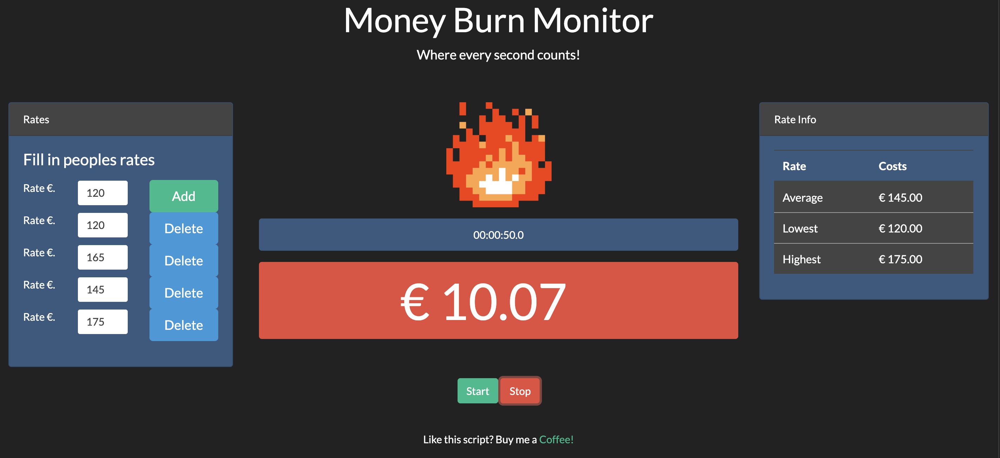
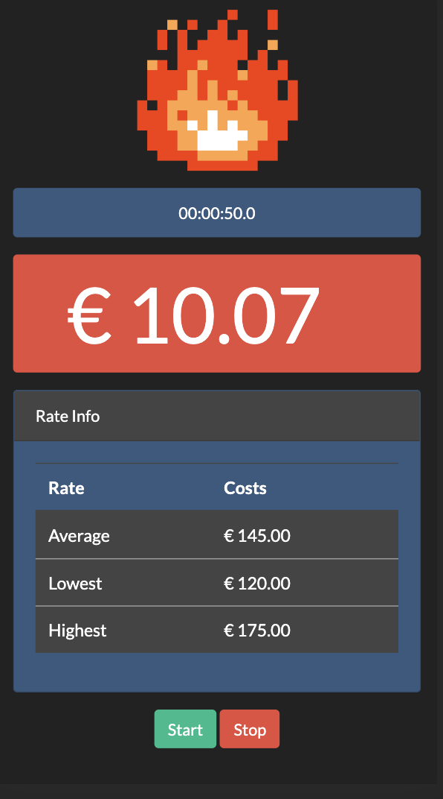

# money-burn-monitor
What does a meeting cost, see it in real time with this money-burn-monitor


<!-- PROJECT SHIELDS -->
[![Contributors][contributors-shield]][contributors-url]
[![Forks][forks-shield]][forks-url]
[![Stargazers][stars-shield]][stars-url]
[![Issues][issues-shield]][issues-url]
[![MIT License][license-shield]][license-url]
[![LinkedIn][linkedin-shield]][linkedin-url]

<!-- PROJECT LOGO -->
<br />
<p align="center">
  <a href="https://github.com/tvdsluijs/money-burn-monitor">
    
  </a>

  <h3 align="center">Money Burn Monitor</h3>

  <p align="center">
    What does a meeting cost, see it in real time with this money-burn-monitor
    <br />
    <a href="https://github.com/tvdsluijs/money-burn-monitor"><strong>Explore the docs »</strong></a>
    <br />
    <br />
    <a href="https://github.com/tvdsluijs/money-burn-monitor">View Demo</a>
    ·
    <a href="https://github.com/tvdsluijs/money-burn-monitor/issues">money-burn-monitorrt Bug</a>
    ·
    <a href="https://github.com/tvdsluijs/money-burn-monitor/issues">Request Feature</a>
  </p>
</p>


<!-- TABLE OF CONTENTS -->
## Table of Contents

* [About the Project](#about-the-project)
  * [Built With](#built-with)
* [Getting Started](#getting-started)
  * [Prerequisites](#prerequisites)
  * [Installation](#installation)
* [Usage](#usage)
* [Roadmap](#roadmap)
* [Contributing](#contributing)
* [License](#license)
* [Contact](#contact)
* [Acknowledgements](#acknowledgements)


<!-- ABOUT THE PROJECT -->
## About The Project

Fill in the rates and press start!



Even responsive mobile ready




<!-- GETTING STARTED -->
## Getting Started

```sh
git clone git@github.com:tvdsluijs/money-burn-monitor.git
```

Open the index.html in your fav browser

### Prerequisites

Nothing !! Only a browser!


<!-- ROADMAP -->
## Roadmap

See the [open issues](https://github.com/tvdsluijs/money-burn-monitor/issues) for a list of proposed features (and known issues).


<!-- CONTRIBUTING -->
## Contributing

Contributions are what make the open source community such an amazing place to be learn, inspire, and create. Any contributions you make are **greatly appreciated**.

1. Fork the Project
2. Create your Feature Branch (`git checkout -b feature/AmazingFeature`)
3. Commit your Changes (`git commit -m 'Add some AmazingFeature'`)
4. Push to the Branch (`git push origin feature/AmazingFeature`)
5. Open a Pull Request


<!-- LICENSE -->
## License

See `LICENSE` for more information.

<!-- CONTACT -->
## Contact

Theo van der Sluijs - [@tvdsluijs](https://twitter.com/tvdsluijs) - theo@vandersluijs.nl

Project Link: [https://github.com/tvdsluijs/money-burn-monitor](https://github.com/tvdsluijs/money-burn-monitor)


<!-- MARKDOWN LINKS & IMAGES -->
<!-- https://www.markdownguide.org/basic-syntax/#reference-style-links -->
[contributors-shield]: https://img.shields.io/github/contributors/tvdsluijs/money-burn-monitor.svg?style=flat-square
[contributors-url]: https://github.com/tvdsluijs/money-burn-monitor/graphs/contributors
[forks-shield]: https://img.shields.io/github/forks/tvdsluijs/money-burn-monitor.svg?style=flat-square
[forks-url]: https://github.com/tvdsluijs/money-burn-monitor/network/members
[stars-shield]: https://img.shields.io/github/stars/tvdsluijs/money-burn-monitor.svg?style=flat-square
[stars-url]: https://github.com/tvdsluijs/money-burn-monitor/stargazers
[issues-shield]: https://img.shields.io/github/issues/tvdsluijs/money-burn-monitor.svg?style=flat-square
[issues-url]: https://github.com/tvdsluijs/money-burn-monitor/issues
[license-shield]: https://img.shields.io/github/license/tvdsluijs/money-burn-monitor.svg?style=flat-square
[license-url]: https://github.com/tvdsluijs/money-burn-monitor/blob/master/LICENSE.txt
[linkedin-shield]: https://img.shields.io/badge/-LinkedIn-black.svg?style=flat-square&logo=linkedin&colorB=555
[linkedin-url]: https://linkedin.com/in/tvandersluijs