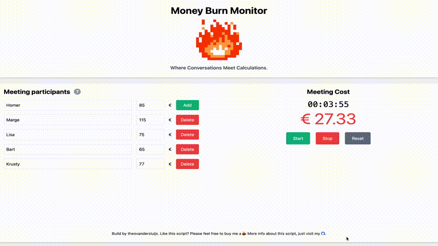

# Money Burn Monitor

[![Contributors][contributors-shield]][contributors-url]
[![Forks][forks-shield]][forks-url]
[![Stargazers][stars-shield]][stars-url]
[![Issues][issues-shield]][issues-url]
[![MIT License][license-shield]][license-url]
[![LinkedIn][linkedin-shield]][linkedin-url]

---

## About The Project

Have you ever wondered just how much money gets burned during a meeting? With **Money Burn Monitor**, you can calculate it in real-time! This tool is perfect for both humorous insights and serious evaluations of your meetings' cost-effectiveness. Fill in the participants' hourly rates, press "Start," and watch as the cost accumulates.

- **Real-time Cost Tracking**
- **Responsive Design** (works beautifully on mobile devices too!)
- **Currency Customization**
- **Fun and Easy to Use**



---

## Why Money Burn Monitor?

Meetings are often poorly planned and unnecessarily long. After attending countless ineffective meetings, I decided to write code instead of participating—and thus, **Money Burn Monitor** was born! The first version was built on **June 16, 2021**, and the project has evolved ever since.

Use this tool as a wake-up call for your team (or manager) to help them realize the true cost of unproductive meetings. Sometimes, numbers speak louder than words!

---

## Built With

- **HTML5**
- **Tailwind CSS**
- **Vanilla JavaScript**

---

## Getting Started

### Prerequisites

You don’t need much—just a browser! No installation, no servers, no hassle.

### Installation

Clone the repository and open `index.html` in your browser of choice:

```sh
git clone git@github.com:tvdsluijs/money-burn-monitor.git
```

---

## Usage

1. Open `index.html` in your browser.
2. Add participants and their hourly rates.
3. Start the timer to see real-time costs.
4. Stop the timer to view a cost breakdown by participant.
5. Reset to clear everything and start over!

---

## Roadmap

Check out the [open issues](https://github.com/tvdsluijs/money-burn-monitor/issues) to see upcoming features or report any bugs.

---

## Contributing

Contributions are what make open source amazing! Whether it’s fixing a bug or adding a new feature, your help is always welcome.

1. Fork the project.
2. Create your feature branch: `git checkout -b feature/AmazingFeature`.
3. Commit your changes: `git commit -m 'Add some AmazingFeature'`.
4. Push to the branch: `git push origin feature/AmazingFeature`.
5. Open a pull request.

---

## License

This project is licensed under the MIT License—see the [LICENSE](https://github.com/tvdsluijs/money-burn-monitor/blob/master/LICENSE.txt) file for details.

---

## Contact

**Theo van der Sluijs**
- Website: [theovandersluijs.eu](https://theovandersluijs.eu)
- GitHub: [@tvdsluijs](https://github.com/tvdsluijs)
- Email: [theo@vandersluijs.nl](mailto:theo@vandersluijs.nl)

---

## Acknowledgments

- The **open-source community** for tools and inspiration.
- My countless hours in unproductive meetings that fueled this idea.
- [Font Awesome](https://fontawesome.com/) for awesome icons.
- **Coffee!** Because every great tool deserves caffeine. [Buy me one?](https://www.buymeacoffee.com/itheo)

---

[contributors-shield]: https://img.shields.io/github/contributors/tvdsluijs/money-burn-monitor.svg?style=flat-square
[contributors-url]: https://github.com/tvdsluijs/money-burn-monitor/graphs/contributors
[forks-shield]: https://img.shields.io/github/forks/tvdsluijs/money-burn-monitor.svg?style=flat-square
[forks-url]: https://github.com/tvdsluijs/money-burn-monitor/network/members
[stars-shield]: https://img.shields.io/github/stars/tvdsluijs/money-burn-monitor.svg?style=flat-square
[stars-url]: https://github.com/tvdsluijs/money-burn-monitor/stargazers
[issues-shield]: https://img.shields.io/github/issues/tvdsluijs/money-burn-monitor.svg?style=flat-square
[issues-url]: https://github.com/tvdsluijs/money-burn-monitor/issues
[license-shield]: https://img.shields.io/github/license/tvdsluijs/money-burn-monitor.svg?style=flat-square
[license-url]: https://github.com/tvdsluijs/money-burn-monitor/blob/master/LICENSE.txt
[linkedin-shield]: https://img.shields.io/badge/-LinkedIn-black.svg?style=flat-square&logo=linkedin&colorB=555
[linkedin-url]: https://linkedin.com/in/tvandersluijs

🚀
